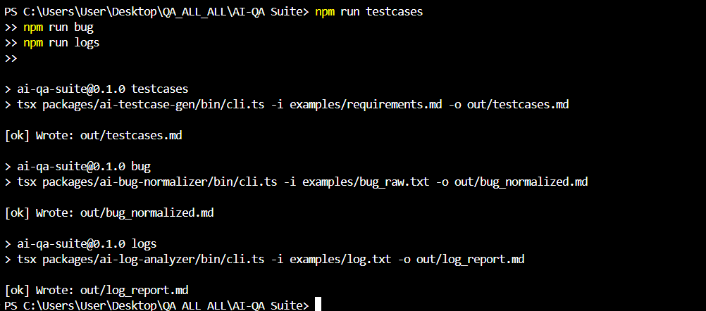

# AI-QA Suite 
Smart tools that accelerate QA workflows using AI.

---

## Overview
**AI-QA Suite** is a set of CLI tools that automate routine QA tasks:
- **AI Test Case Generator** — generates structured test cases from requirements.
- **AI Bug Normalizer** — converts raw bug reports into a clean Jira-like format.
- **AI Log Analyzer** — analyzes logs and suggests possible root causes.

---

## Run the Tools

```bash
npm run testcases   # generate test cases from requirements.md
npm run bug         # normalize bug report from bug_raw.txt
npm run logs        # analyze log.txt and summarize root causes
```
---

## Structure

examples/ → input files (requirements, bugs, logs)
out/      → generated outputs
packages/ → source code of each AI tool

---

## Example Output

### Test Case Generator
Input: `examples/requirements.md`  
Output: `out/testcases.md`

```md
# User Registration and Login
- User can register with valid email/password
- User receives confirmation email
- User can log in after confirmation

---

Bug Normalizer

Input: examples/bug_raw.txt
Output: out/bug_normalized.md

**Title:** Intermittent Submission Failure  
**Severity:** High  
**Steps:** 1) Open form 2) Fill fields 3) Submit  
**Expected:** Always success  
**Actual:** App freezes randomly

---

Log Analyzer

Input: examples/log.txt
Output: out/log_report.md

- 3 unique error patterns detected  
- Possible root cause: DNS resolution timeout  
- Suggestion: monitor request latency

---


## CLI 



> Built by Aleksei Sosin (2025). MIT Licensed.